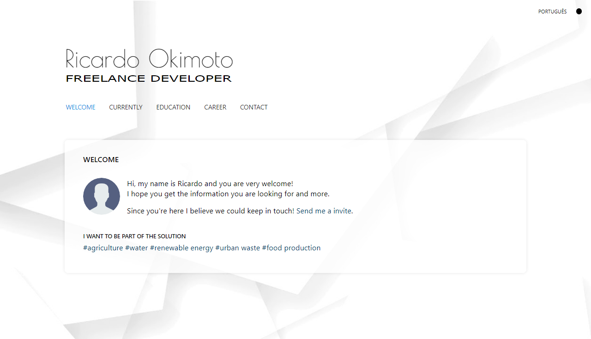
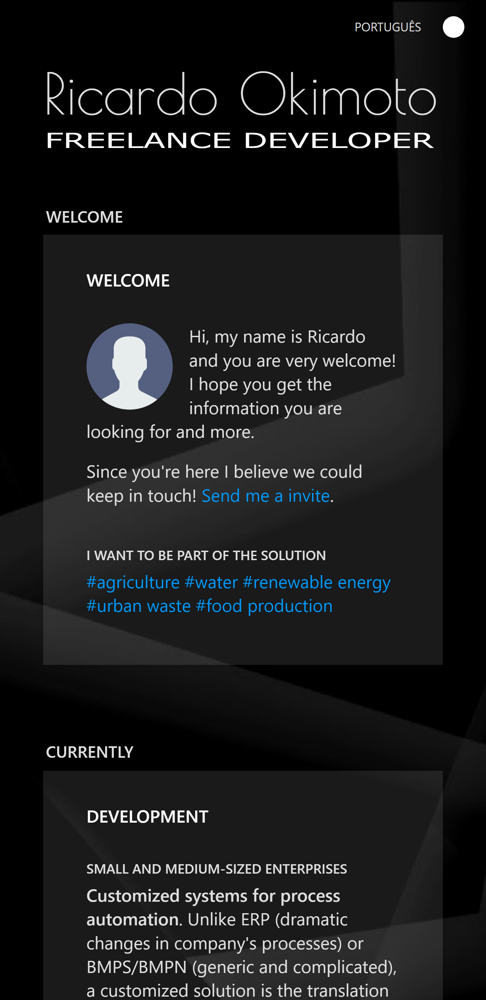
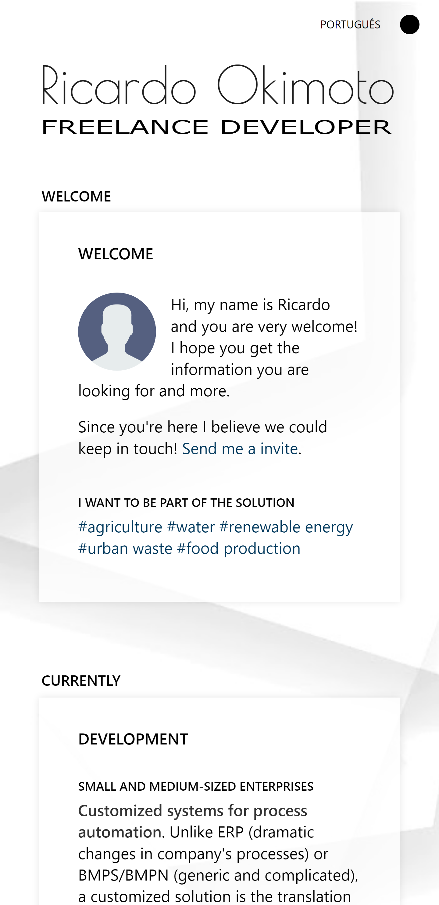

# My homepage source

A simple React App hosted on GitHub: [link](https://okimas.github.io/home/).

`full-stack` `node` `mongo` `react` `react native` `android` `electron` `electron-builder` `desenvolvimento` `freelancer` `plataformas` `automatização` `sistemas`

## Details

You can see in the code that all the content of page come from a object `staticData.`. That's because I intend to create a MERN project based on this app that loads content from MongoDB. Also includes login and routes requests with nodeJS/express. Simple but a good reference to start.

### Screens

    

    
    

